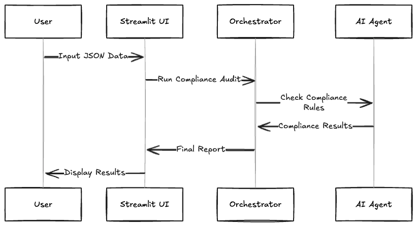
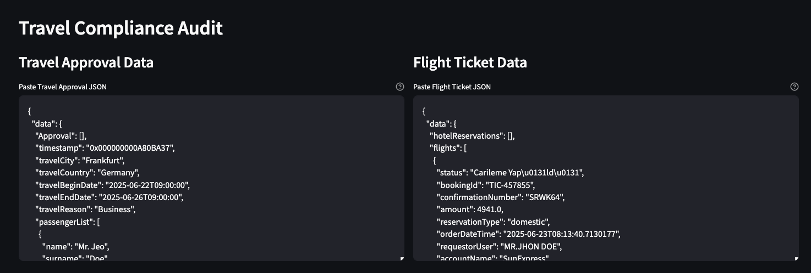
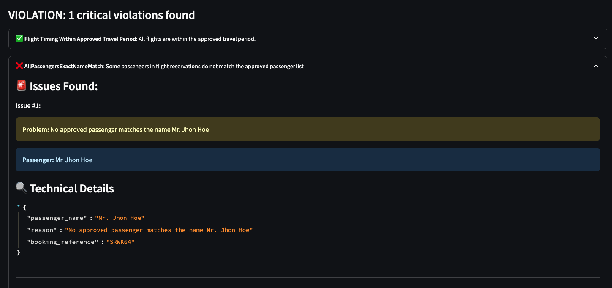

# ✈️ Travel Compliance Agent

> **Version 0.3**

An AI-agent powered automation solution for auditing travel booking compliance.

## 🌐 Live Demo

**Try it now:** [https://travel-compliance-agent-6btjffnp4rs4zcp6wn9dz5.streamlit.app/](https://travel-compliance-agent-6btjffnp4rs4zcp6wn9dz5.streamlit.app/)

_Note: You'll need your own OpenAI API key to use the live demo._

## 🎯 Project Overview

This system automatically audits travel bookings against three key compliance rules:

1. **Flight Ticket Timing** - Ensures departure and arrival times fall within approved travel periods
2. **Passenger Identity** - Validates passenger name consistency between approvals and reservations
3. **Route Compliance** - Checks prefered airline's routes from json database

### Application Flow Diagram



The system follows a clear sequential flow from API key validation through compliance checking to report generation, with proper error handling at each stage.

## 🚀 Tech Stack

- **AI Model**: OpenAI reasoning models - Complex compliance rule interpretation
- **AI Framework**: LangChain - Mature ecosystem for simplified LLM integration and prompt management
- **Backend**: Python 3.9+ - Native AI/ML ecosystem enabling rapid prototyping and maintainable code
- **UI**: Streamlit - Rapid web development with rich UI components and seamless Python integration
- **Testing**: Pytest - Standard testing framework with comprehensive coverage
- **Environment**: python-dotenv - Secure environment variable management

## 🖥️ Work Examples

The application provides an intuitive web interface for compliance auditing:

**Input Interface:**


**Output Results:**


_The interface shows real-time compliance checking with detailed violation reports and technical details for transparency._

## 📦 Installation

1. **Clone the repository**

```bash
git clone <repository-url>
cd travel-compliance-agent
```

2. **Install dependencies**

```bash
pip install -r requirements.txt
```

3. **Set up environment variables**

```bash
cp .env.example .env
# Edit .env and add your OpenAI API key
```

4. **Run the application**

```bash
streamlit run app.py
```

## 🔮 Possible Future Improvements

The following improvements are planned to enhance the system's capabilities and production readiness:

### 🏗️ Architecture & Infrastructure

- **Frontend Migration to React** - Transition from Streamlit to React-based frontend for improved state management, enhanced user experience, and better scalability
- **Serverless Architecture** - Refactor to serverless deployment with automated alert mechanisms for cost-effective, event-driven processing
- **Retry Mechanisms** - Implement robust retry logic with exponential backoff for improved reliability and fault tolerance across all external API calls

### 🤖 AI & Model Enhancements

- **Improve Model Support** - Integrate additional AI model providers (Anthropic Claude, Google Gemini, DeepSeek or Grok) for enhanced flexibility and cost comparison
- **Dynamic Schema Understanding** - Enable agents to dynamically parse and understand JSON field structures through integrated API documentation uploads
- **LLM Monitoring & Observability** - Implement comprehensive monitoring for model performance, token usage, response quality, and error tracking

### 📊 Data & Integration

- **Real-time Data Fetching** - Replace static JSON databases with live API integrations for airline routes, approval workflows, and ticket reservations
- **Cost Tracking & Analytics** - Implement detailed cost monitoring for API usage, processing time, and operational expenses with automated reporting

### 🔧 Operations & Monitoring

- **Performance Metrics** - Add comprehensive dashboards for system health, processing times, and compliance audit success rates
- **Automated Alerting** - Configure intelligent notification systems for compliance violations, system errors, and operational anomalies
