# 🏗️ Travel Compliance Agent - Architecture Flow

## System Overview

The Travel Compliance Agent uses a multi-agent architecture to automate travel booking compliance auditing. Here's how the system flows:

## Agent Responsibilities

### 1. Schema Validation Agent

- **Purpose**: Validates input JSON structure using AI
- **Technology**: OpenAI GPT-4 with structured prompts
- **Process**:
  1. Receives JSON data
  2. Checks required fields
  3. Validates data types
  4. Verifies date formats
  5. Returns validation results

### 2. Compliance Agent

- **Purpose**: Core business rule enforcement
- **Sub-agents**:
  - **Timing Checker**: Validates flight times against travel approval
  - **Identity Checker**: Matches passengers between approval and tickets
  - **Route Checker**: Enforces airline compliance rules

### 3. Chat Agent

- **Purpose**: Interactive Q&A about compliance results
- **Technology**: OpenAI GPT-4 with context-aware prompting
- **Features**:
  - Answers specific compliance questions
  - Explains violation details
  - Provides regulatory guidance

## Data Flow

## Technology Stack Rationale

### Why LangChain?

- **Agent Framework**: Built-in support for multi-agent systems
- **Prompt Management**: Structured prompt templates
- **OpenAI Integration**: Seamless API connectivity
- **Extensibility**: Easy to add new agents and tools

### Why Streamlit?

- **Rapid Development**: Quick UI prototyping
- **Interactive Components**: Built-in chat, file upload, forms
- **Python Native**: No frontend/backend separation
- **Real-time Updates**: Live data visualization

### Why Pydantic?

- **Type Safety**: Runtime type validation
- **Data Parsing**: Automatic JSON to object conversion
- **Error Handling**: Clear validation error messages
- **IDE Support**: Full autocomplete and type hints

## Compliance Rule Implementation

### Timing Compliance Flow

```mermaid
graph LR
    A[Flight Data] --> B[Extract Dates]
    B --> C[Travel Approval Dates]
    C --> D{Within Period?}
    D -->|Yes| E[✅ Compliant]
    D -->|No| F[❌ Violation]
    F --> G[Log Details]
```

### Identity Compliance Flow

```mermaid
graph LR
    A[Passenger List] --> B[Normalize Names]
    B --> C[Approval List]
    C --> D{Name Match?}
    D -->|Yes| E{Employee ID Match?}
    D -->|No| F[❌ Unknown Passenger]
    E -->|Yes| G[✅ Compliant]
    E -->|No| H[❌ ID Mismatch]
```

### Route Compliance Flow

```mermaid
graph LR
    A[Flight Data] --> B[Check Account]
    B --> C{SunExpress Account?}
    C -->|No| D[✅ Any Airline OK]
    C -->|Yes| E{Airline = XQ?}
    E -->|Yes| F[✅ Compliant]
    E -->|No| G[❌ Wrong Airline]
```

## Error Handling Strategy

1. **Graceful Degradation**: System continues operating with partial data
2. **User Feedback**: Clear error messages and suggestions
3. **Validation Layers**: Multiple validation checkpoints
4. **Fallback Options**: Default behaviors for edge cases

## Performance Considerations

- **Async Operations**: Non-blocking API calls where possible
- **Caching**: Session state for repeated operations
- **Batch Processing**: Efficient handling of multiple bookings
- **Rate Limiting**: Respectful API usage patterns

## Security & Privacy

- **API Key Handling**: Secure storage and validation
- **Data Processing**: No persistent storage of sensitive data
- **Input Sanitization**: Protection against malicious inputs
- **Error Logging**: No sensitive data in logs

## Testing Strategy

### Unit Tests

- Individual agent functionality
- Pydantic model validation
- Utility function verification

### Integration Tests

- End-to-end compliance checking
- Multi-agent coordination
- Real data scenario testing

### Scenario Coverage

- **Positive Cases**: All rules pass
- **Negative Cases**: Various violation types
- **Edge Cases**: Boundary conditions
- **Data Variations**: Different input formats

## Scalability Considerations

### Current Limitations

- Single-user session model
- Synchronous processing
- In-memory data handling

### Future Scaling Options

- Multi-user support with authentication
- Async processing with job queues
- Database integration for persistence
- Microservice architecture for high volume
